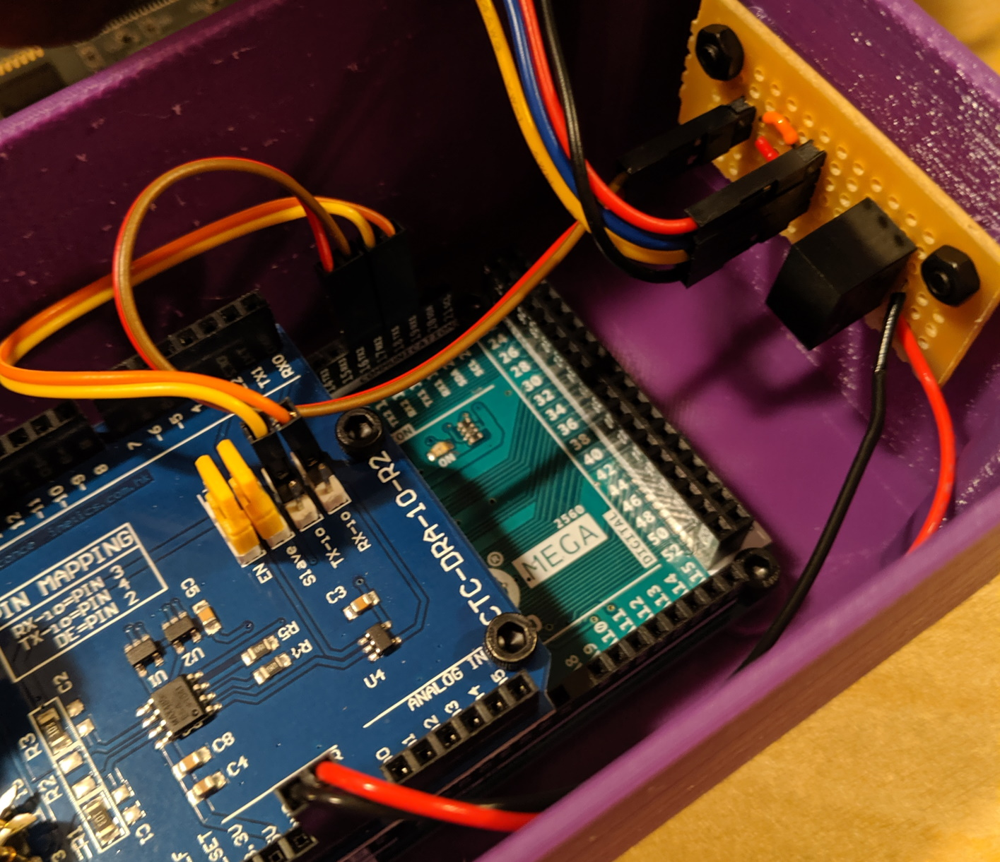
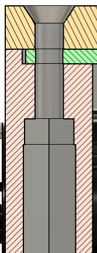
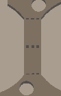
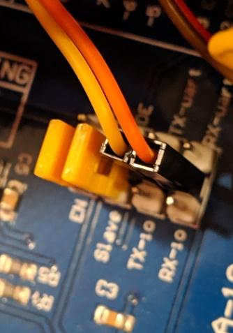

# Building the DMX Inspector

The DMX Inspector consists of three off-the-shelf components and a small connector board with a 5V regulator.
* Arduino Mega 2650: The Mega is needed for additional COM ports and memory
  * Serial0 is reserved for USB connection to the PC for programming and debugging
  * Serial1 is used for reading the DMX signal
  * Serial2 is used for communicating with the Nextion display
  * Code compiles to 27630 bytes (10% of Mega's program space) and globals use 1684 bytes of RAM. Additionally there are some largish buffers that are dynamically allocated by libraries.
* DMX Shield made by Conceptinetics (CTC-DRA-10-R2 or similar). The shield is designed for either DMX Master or Slave functionality, but this build is specifically to function as a slave device.
* Nextion NX4827K043_011 display. This is a 4.3" TFT touch display, 480 x 272 pixels of Nextion's **Enhanced** series. While I am not using any instructions that are **Enhanced** only, I have only tested this on this specific model. Any different screen size will require changes to the Nextion HMI project.
* Breadboard wired with:
  * 5v regulator @ 500ma. I used a tiny inexpensive ($0.25) switching regulator that my local electronics store had picked up, but any regulator will work.
  * JP1 2-pin header to connect to the Arduino Serial2 port
  * JP2 4-pin header to connect to the Nextion Display

## Case
The case STL files provide a case to hold the boards securely and provide a nice bezel for the Nextion Display. I printed this in MatterHackers PLA on an Ultimaker 3 printer with 0.4mm nozzle and 0.15mm layers without support. The bezel is printed face down, the box bottom down. The spacers required are:
* 2x shortSpacer.stl: These are the standoffs for the breadboard. Any suitable spacer could be used here.
* 3x Spacer.stl: These hold the DMX Shield in place and are for the two end screw positions and the screw position by the power connector
* 1x SpacerWithCutout.stl: This spacer has a notch to clear the 2x3 header on the Arduino board near the hole.
This was about a 16 hour print.

## The Power and Distribution Breadboard
[Breadboard Schematic](pics/DMXInspectorSchematic.svg "Schematic of DMXInspector") 

The schematic shows the connections that need to be made. One could connect the Nextion display wires directly to the Arduino pins, but the Nextion connector cable comes with female header connectors. Also, having all four wires connecting to the same connector, and in the same order as the Nextion header made for a nicer build.

I built these on some old Radio Shack breadboards that had mounting holes 35.2mm (approx 1.4 inches) apart. It's probably easiest to mark your board to match the mounting holes and drill appropriate holes in the board.

NOTE: Be sure that the wires from the Arduino Serial2 port connect correctly to the breadboard so that the Arduino TX2 connects to the Nextion RX and the Arduino RX2 connects to the Nextion TX. Also be sure to have the correct polarity on the power connections.

NOTE: The Nextion display draws too much power to be supplied by the +5V regulator on the Arduino itself. One **might** be able to power the whole thing from USB without a regulator, but that would be pushing things.

## Assembling
At this point you've printed the case and assembled the breadboard. Now we'll put everything together.

### Preparing The Case
After printing the case, it is good to take a moment to get things prepared for assembly. You will want the following hardware:
* 4x 25mm M3 cap head screws: holds both the Arduino and DMX Shield firmly in place. These could be considered optional.
* 6x 8mm M3 cap head screws: 2 to hold the end of the Arduino in place, 4 to provide extra rigidity for the XLR connectors
* 2x 10mm M3 flat head screws: holds the breadboard in place
* 4x 16mm M3 flat head screws: holds the display and bezel in place
* 12x M3 hex nuts.

You will also need tools:
* 2.5mm hex screwdriver: all cap head screws
* 2mm hex strewdriver: all flat head screws
* A long (maybe 40mm) M3 screw. Yes, this is used as a tool.

#### Captive Nuts
Most of the nuts used in this build are held in place by hex depressions designed into the case. In my experience the hex holes are printed so that the nuts fit snuggly thus making it easy to pre-place them. All of these holes are printed on the bottom surface of the case, so (unless you used support) there will be a couple of loops where the hex turns into a circular hole. Just clean this loop out of each of the shallow holes (we'll get to the corners in a moment). Then seat the 6 nuts into the bottom of the case. Two ways to do this depending on how tight the holes are:
* Thread a nut onto the end of a screw and then press it into the hole. Once the nut is flush to the bottom of the case, unscrew the screw leaving the nut in the case.
* Put a screw (one of the 10mm should work) through the hole, without the boards in place. Thread a nut onto the screw and then tighten it to pull the nut into the hole. After it's set in place, remove the screw.

#### Corner Nuts
The corners are a bit of a special case. They are designed to use 16mm flathead screws, but the case is much more than 16mm high. So the hex holes run almost the height of the case. As you can see in the cross section most of the hex column is wider than the very top of it. This is so you can easily push a nut up in the column and then draw it tight and snug into the top 3mm.

This is where that long M3 screw is used as a tool. You'll want to use two long-ish screws for this step, one of the 25mm screws will work well for the other one. 

First push the 25mm screw down through the hole at the top of the case (just the main case part--don't use the bezel here). This will push any filament loops from the transition from hex to circular hole out of the way. 

Next, thread a nut just on the end of the 40mm screw and push the nut up the hex column. It should hit the end of the 25mm screw. Now we're going to transfer the nut from the 40mm screw to the 25mm screw. Unscrew the 40mm screw a couple of turns. Then tighten the 25mm screw a couple of turns. This should allow it to grip the nut and you'll feel it bottom against the end of the long screw. Then unscrew the long screw and remove it.

Now tighten the short screw until snug. At this point the nut should be captive in the very end of the hex hole. Unscrew the 25mm screw being sure not to push the nut back out.

Do this for all four corner nuts.

### Remove support
There is a small piece of support modelled into the design between the holes for the two XLR connectors. There are "mouse bites" or perforations modelled into it to make it easy to remove. Just cut the support at the middle set of perforations and then break the pieces from the top and bottom perforations.

 

### DMX Shield
The DMX Shield is designed to select between Serial0 (the only serial port on an UNO) or IO Pins through the use of jumpers. We are using a third option, connecting to Serial1. The center pin of the TX and RX pins on the shield connect to the RS485 chip. We'll connect those via jumper wires to the TX1 and RX1 connections on the Arduino Mega. Be sure to match TX to TX1 and RX to RX1. Also set the other two jumpers both to the right side as shown in this picture.

 

Carefully insert the DMX Shield into the headers of the Arduino Mega. They mount into the headers on the end closest to the power and USB connectors, using the same signals as present on the Arduino UNO. Then mount it in the case.

### Mounting the Arduino and DMX Shield
I found that fitting the board into place is easiest if you pre-position the 4 25mm screws through the DMX Shield, spacers, and Arduino but only flush with the Arduino board. Once in place, you won't be able to reach the spacers near the front of the board unless you have tiny fingers or bent-nose pliers. 

Also, there is a pin from the power connector that is right in front of the hole on that side of the Arduino. I found that bending it over made an easier fit.

Tilt the board so the spring button of the female XLR connector goes through the hole first, then line up the USB connector with its hole in the case. Things are a little snug, but once in place the USB will stick through the case by about 4mm and the power connector will be flush with the case. Both of the XLR connectors will be just a little past the case as well.

Now tighten the 25mm screws into the captive nuts. The screws should leave just a thread or so showing on the bottom nuts. Also, insert the two 10mm screws in the end of the Arduino board and tighten. You can also thread 8mm M3 screws into the XLR connectors (no nuts needed.)

Mount the breadboard on the back wall of the case and connect all of the wires.

### Wiring

| From | To | Notes |
| --------------- | --- | ----- |
| DMX Vin | 5V Vin | Power for the breadboard, and thus the display,  comes from Vin (sometimes labled Vraw) on the headers atop the DMX Shield.|
| DMX GND | 5V GND | And the ground connection |
| DMX TX | Arduino TX1 (18) | DMX Transmit pin (Not used by this tool, but if you want to repurpose for a controller, or RDM, this is needed) |
| DMX RX | Arduino RX1 (19) | DMX Receive pin |
| Arduino TX2 (16) | Breadboard JP1 TX2 | Connects to Display RX via breadboard connections. Sends data **to** the display. |
| Arduino RX2 (17) | Breadboard JP1 RX2 | Connects to Display TX via breadboard connections. Receives responses **from** the display. |
| Display +5V | Breadboard JP2 5V Vout | Regulated 5V to the display |
| Display TX | Breadboard JP2 TX | Sends data **from** the display |
| Display RX | Breadboard JP2 RX | Sends data **to** the display |
| Display GND | Breadboard JP2 GND | Ground connectino to the display |

### Bezel
Lay the display on top of the corner supports. The case is a little longer than the display so there is room for the wires from the display connector to bend down. Thus the cable connection goes on the end toward the breadboard and the SD slot on the display faces the notch on the top of the case wall.

Set the bezel over the display. It should align properly with the screw holes and fit easily over the display. Mount in place with 4 16mm M3 flat head screws, tightening into the nuts you set in the earler step.

## Program the Display
* Load the file DmxDisplay.tft (in the /Display directory) onto the root of an empty SD card (FAT32 formatted, 32GB max).
* Put the SD card in the slot. The card contacts face UP. The slot is spring loaded, and when properly seated the SD card will be flush with the case.
* Connect power to the Arduino. The display will show the bootloader and the bootloader will load the firmware from the SD card. Wait until it displays its success message.
* Unplug the power.
* Remove the SD card (press in to click and release)
* Plug in the power. The display should show the empty grid with a label across the top "Updating Display..."

## Build the Arduino code
Full instructions for building the code are in the Arduino code README.

* Connect power
* Connect USB
* Upload code from the Arduino IDE (or VS Code)
* Connect to your DMX Universe.

## Defining Devices
The names and channel numbers for devices are clearly not going to be correct for your DMX universes. Therefore, you'll want to update the code to match your setup.

See the Arduino code README for details.

