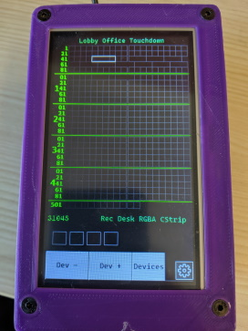
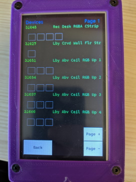

# DMX Inspector
The DMX Inspector is an Arduino-based device that will read out the data being sent on a DMX512 universe. This provides a developer of DMX control software and/or sequences with a desktop debugging display that confirms the data being sent to the lighting without having to actually be connected to a universe of DMX devices. It is a passive, read-only device.

 

This project consists of several pieces:
* /Arduino: This is the project for the Arduino that does the actual work of listening to the DMX signal and driving the display. It relies on two libaries that must be installed in Arduino to communicate with the DMX hardware and the display:
  * Conceptinetics library as updated for this work: Clone from https://github.com/johnseghersmsft/Conceptinetics_RDM
  * Nextion libary as modified: https://github.com/johnseghersmsft/ITEADLIB_Arduino_Nextion
  Find detailed [build instructions at the Arduino/DmxInspector README](Arduino/DmxInspector/README.md)

* /Display: This is the Nextion code that powers the display. It uses a binary project file, `DmxDisplay.HMI` that can only be edited
  with [their editor, version 0.58](https://nextion.tech/). The DmxDisplay.tft file is the target file that can be loaded
  on a display by copying onto an SD card.
  * Insert the SD card into the display while powered off. 
  * Connect power and the bootloader will copy the file to the display.
  * Power down and remove the SD Card before powering back on.

* /Case: This contains the STL files for the case to hold the Arduino Mega, DMX Shield and Nextion display. I printed this in PLA using a 0.4mm nozzle at 0.15mm layer height without support. [See the README for more build details](Case/README.md)

# Contributing

This project welcomes contributions and suggestions.  Most contributions require you to agree to a
Contributor License Agreement (CLA) declaring that you have the right to, and actually do, grant us
the rights to use your contribution. For details, visit https://cla.opensource.microsoft.com.

When you submit a pull request, a CLA bot will automatically determine whether you need to provide
a CLA and decorate the PR appropriately (e.g., status check, comment). Simply follow the instructions
provided by the bot. You will only need to do this once across all repos using our CLA.

This project has adopted the [Microsoft Open Source Code of Conduct](https://opensource.microsoft.com/codeofconduct/).
For more information see the [Code of Conduct FAQ](https://opensource.microsoft.com/codeofconduct/faq/) or
contact [opencode@microsoft.com](mailto:opencode@microsoft.com) with any additional questions or comments.
